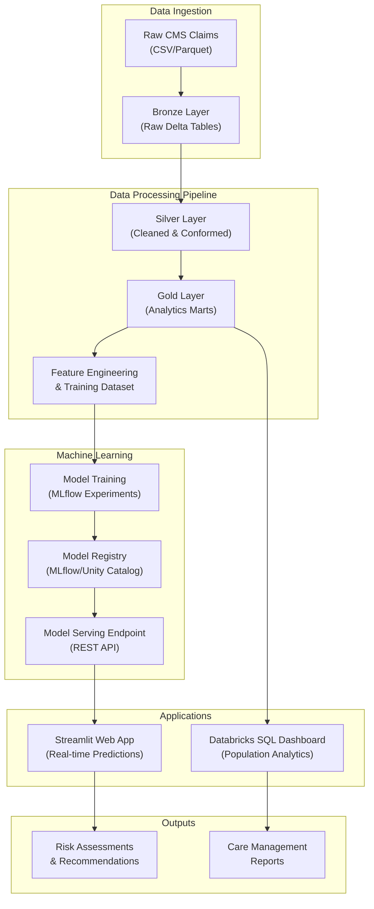

# Population Health & Readmission Risk
End-to-end analytics pipeline to predict 30-day readmission risk from CMS Medicare claims data and deliver actionable population stratification for care management through an interactive web application.

## Business Problem
- Unplanned 30-day hospital readmissions drive avoidable healthcare costs and lower quality scores.
- Care management teams need a ranked list of high-risk members with explainable drivers to prioritize interventions.
- Leadership needs measurable financial impact (expected savings, ROI) from targeted care management programs.
- Clinicians need real-time risk assessment tools to make informed discharge planning decisions.

## Solution Overview
This project delivers a complete machine learning pipeline and deployment infrastructure:
- **Data Pipeline**: Automated ETL processing of CMS claims data using Medallion architecture
- **ML Model**: Production-ready readmission risk prediction model with 30-day forecast horizon
- **Web Application**: Interactive Streamlit app for real-time patient risk assessment
- **Analytics Dashboard**: Population health dashboard for care management teams
- **Model Monitoring**: MLflow integration for experiment tracking and model versioning

## Data & Tech Stack
- **Data Sources**: 
  - CMS Medicare claims (inpatient, outpatient, carrier/professional)
  - Beneficiary summary (demographics, chronic conditions)
  - Prescription drug events (Part D)
  - National Drug Code Directory (NDCD) reference data
  - Social determinants of health (SDH) data
- **Platform**: 
  - **Databricks** (Unity Catalog, Delta Lake, Workflows, Model Serving)
  - **Apache Spark** for distributed data processing
  - **MLflow** for model tracking, registry, and deployment
- **Data Architecture**: Medallion design (**Bronze → Silver → Gold**)
  - Bronze: Raw data ingestion with minimal transformation
  - Silver: Cleaned, conformed, and validated data
  - Gold: Analytics-ready feature tables and aggregations
- **ML Framework**: PySpark ML, scikit-learn compatible models
- **Deployment**: 
  - **Databricks Model Serving** for real-time inference endpoints
  - **Streamlit** web application for user interface
- **Orchestration**: Databricks Workflows for automated pipeline execution
- **Visualization**: Databricks SQL Lakeview dashboards
- **Versioning/CI**: GitHub for version control

## Architecture Diagram



## Project Structure

```
Population_Health_-_Readmission_Risk/
│
├── 1.setup/
│   └── utilities.ipynb              # Configuration and schema definitions
│
├── 2.preprocess_bz_silv/            # Bronze → Silver transformations
│   ├── CMS/                          # CMS claims processing
│   │   ├── dim/                      # Dimension tables (beneficiary summary)
│   │   └── fact/                     # Fact tables (claims, prescriptions)
│   ├── NDCD/                         # Drug code reference data
│   └── SDH/                          # Social determinants of health
│
├── 3.preprocessing_gld/             # Silver → Gold transformations
│   └── gold_preprocessing.ipynb     # Feature engineering and analytics marts
│
├── 4.Machine_Learning/
│   ├── ML MODEL.ipynb               # Model training and MLflow experiments
│   └── readmission-pre-app/         # Streamlit web application
│       ├── app.py                   # Main application interface
│       ├── requirements.txt         # Python dependencies
│       └── .streamlit/              # Streamlit configuration
│
└── 5.Dashboard/
    └── MEDICARE POPULATION HEALTH & RISK MANAGEMENT DASHBOARD.lvdash.json
                                     # Databricks Lakeview dashboard definition
```

## Key Features & Outputs

### 1. Data Pipeline
- **Bronze Layer**: Raw data ingestion with schema validation
- **Silver Layer**: Data cleansing, deduplication, and conformance
  - Standardized patient identifiers
  - Cleaned diagnosis and procedure codes
  - Validated claim amounts and dates
- **Gold Layer**: Analytics-ready feature tables
  - Patient-level risk features and comorbidity scores
  - Utilization history (prior admissions, ER visits)
  - Readmission labels for training
  - Time-windowed aggregations (6-month, 30-day lookback)

### 2. Machine Learning Model
- **Model Type**: Binary classification for 30-day readmission risk
- **Features**: 
  - Chronic condition indicators (10+ conditions)
  - Prior utilization patterns (admissions, ER visits)
  - Demographic factors (age, gender, race)
  - Comorbidity burden score
- **Performance Metrics**: AUC-ROC, Precision-Recall tracked in MLflow
- **Explainability**: Feature importance analysis for clinical interpretability
- **Deployment**: REST API endpoint via Databricks Model Serving

### 3. Web Application (Streamlit)
- **URL**: Deployed on Databricks Apps
- **Features**:
  - Real-time patient risk assessment
  - Interactive feature input forms
  - Risk score visualization with optimal threshold
  - Explainable AI insights (feature contributions)
  - Care management recommendations based on risk tier
- **Integration**: Direct connection to Databricks Model Serving endpoint

### 4. Analytics Dashboard
- **Platform**: Databricks SQL Lakeview
- **Key Views**:
  - Population risk distribution and segmentation
  - Top 10% high-risk patient cohorts
  - Comorbidity and utilization pattern analysis
  - Cost impact projections and ROI estimates
  - Trend analysis and intervention tracking

## Link to Business Presentation (Critical)
📊 **Business Deck (Canva)**: [View Presentation](https://www.canva.com/design/DAG9i6gBNGU/uWBBuT-7blUsqGmbvIYwmg/edit?utm_content=DAG9i6gBNGU&utm_campaign=designshare&utm_medium=link2&utm_source=sharebutton)

This presentation provides executive-level overview of:
- Business case and ROI analysis
- Solution architecture and capabilities
- Key findings and model performance
- Implementation roadmap and success metrics

## Setup & Installation

### Prerequisites
- Databricks workspace with Unity Catalog enabled
- Cluster with Databricks Runtime 13.0+ (ML recommended)
- Access to CMS Medicare claims data
- Python 3.9 or higher for local development

### Environment Setup

1. **Configure Databricks Workspace**
   ```bash
   # Set up Unity Catalog schemas
   CREATE CATALOG IF NOT EXISTS phr;
   CREATE SCHEMA IF NOT EXISTS phr.01_bronze;
   CREATE SCHEMA IF NOT EXISTS phr.02_silver;
   CREATE SCHEMA IF NOT EXISTS phr.03_gold;
   ```

2. **Clone Repository**
   ```bash
   git clone https://github.com/<your-username>/Population_Health_-_Readmission_Risk.git
   cd Population_Health_-_Readmission_Risk
   ```
   > Replace `<your-username>` with your GitHub username if working with a fork

3. **Set Up Data Pipeline**
   - Import notebooks into Databricks workspace
   - Update workspace paths in `utilities.ipynb`
   - Configure data source locations in Bronze layer notebooks

4. **Install Streamlit App Dependencies** (for local testing)
   ```bash
   cd 4.Machine_Learning/readmission-pre-app
   pip install -r requirements.txt
   ```

## How to Run

### Data Pipeline Execution

1. **Bronze Layer - Data Ingestion**
   - Load raw CMS claims files into designated storage location
   - Run Bronze preprocessing notebooks in `2.preprocess_bz_silv/`
   - Validate data quality and schema conformance

2. **Silver Layer - Data Cleansing**
   - Execute Silver transformation notebooks
   - Apply data quality rules and standardization
   - Create cleaned dimension and fact tables

3. **Gold Layer - Feature Engineering**
   - Run `3.preprocessing_gld/gold_preprocessing.ipynb`
   - Generate analytics marts and training datasets
   - Create aggregated features and readmission labels

### Model Training & Deployment

4. **Train ML Model**
   - Open `4.Machine_Learning/ML MODEL.ipynb`
   - Configure MLflow experiment tracking
   - Execute training cells to:
     - Load features from Gold layer
     - Train readmission risk classifier
     - Log metrics and artifacts to MLflow
     - Register best model to Unity Catalog

5. **Deploy Model Serving Endpoint**
   - Create Databricks Model Serving endpoint
   - Deploy registered model from Unity Catalog
   - Configure endpoint URL and authentication
   - Test endpoint with sample predictions

### Application Deployment

6. **Deploy Streamlit Web Application**
   - Upload app files to Databricks Apps or external hosting
   - Configure authentication secret:
     ```bash
     # For Databricks Apps (automatic):
     # Token is automatically injected via st.secrets['DATABRICKS_TOKEN']
     
     # For local/external deployment:
     # Create .streamlit/secrets.toml file:
     echo 'DATABRICKS_TOKEN = "dapi..."' > .streamlit/secrets.toml
     ```
   - Update `ENDPOINT_URL` in `app.py` with your serving endpoint:
     ```python
     # Example format:
     ENDPOINT_URL = "https://<workspace-url>/serving-endpoints/<endpoint-name>/invocations"
     # e.g., "https://dbc-abc123.cloud.databricks.com/serving-endpoints/readmission/invocations"
     ```
   - Launch application:
     ```bash
     streamlit run app.py
     ```

7. **Set Up Analytics Dashboard**
   - Import `5.Dashboard/*.lvdash.json` to Databricks SQL
   - Connect dashboard to Gold layer tables
   - Configure refresh schedules for real-time updates
   - Share dashboard with care management teams

## Usage Examples

### Batch Risk Scoring
Generate risk scores for entire patient population:
```python
# Load gold dataset
patient_df = spark.table("phr.03_gold.readmission_events")

# Score using MLflow model
model = mlflow.pyfunc.load_model("models:/readmission_model/champion")
predictions = model.predict(patient_df)

# Save results
predictions.write.mode("overwrite").saveAsTable("phr.03_gold.risk_scores")
```

### Real-time Risk Assessment via Web App
1. Navigate to deployed Streamlit application
2. Enter patient demographics and clinical features
3. Submit for real-time risk prediction
4. Review risk score, risk tier, and recommendations
5. Access feature importance for clinical decision support

### Dashboard Analytics
- Access Databricks SQL dashboard
- Filter by risk tiers, demographics, or time periods
- Drill down into high-risk patient cohorts
- Export reports for care management meetings

## Key Considerations

### Data Privacy & Security
- All patient data is de-identified (DESYNPUF_ID synthetic identifiers)
- Implement HIPAA-compliant access controls in production
- Use Databricks secrets for credential management
- Enable audit logging for compliance tracking

### Model Monitoring
- Track model performance metrics over time in MLflow
- Set up alerts for prediction drift or degraded performance
- Regularly retrain model with new data (recommended quarterly)
- Maintain champion/challenger model comparison

### Performance Optimization
- Use Delta Lake liquid clustering for large tables
- Implement Z-ordering on frequently filtered columns
- Cache frequently accessed feature tables
- Use Photon acceleration for Spark queries

## Contributing
This is an academic/demonstration project. For questions or issues, please open a GitHub issue.

## License
This project uses synthetic CMS data for educational purposes.
